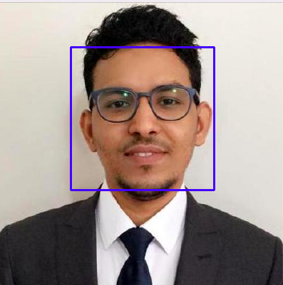

# Face Detection Using OpenCV
This script can detect faces in a given image using
OpenCV.

### Examples


### Running the script
```commandline
python detect_faces.py
```

### Libraries Used
- OpenCV

### *Author Name*
[Mohamed El Hacen Habib](https://github.com/mohamedelhacen)
