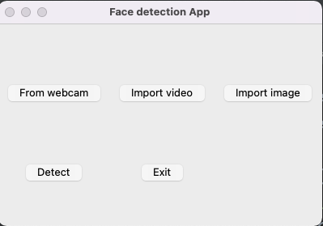
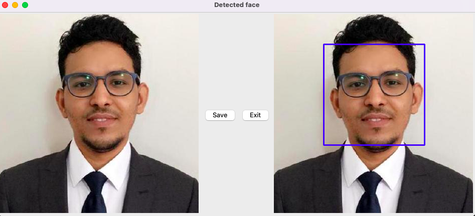

# Face Detection Using OpenCV
This Python GUI asks the user to choose the webcam or 
to enter an image or video path and then detect the faces presents in
the provided file. After that asks the user to save the result image or 
to exit the opened window.

### Examples



### Running the script
```commandline
python detect_faces.py
```

### Libraries Used
- OpenCV
- Tkinter
- PIL

### *Author Name*
[Mohamed El Hacen Habib](https://github.com/mohamedelhacen)
